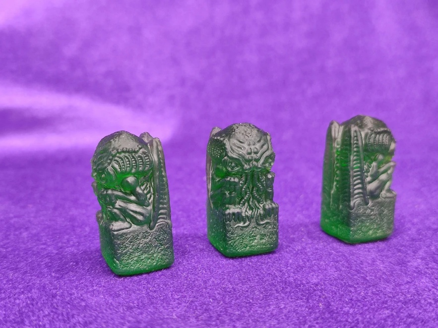
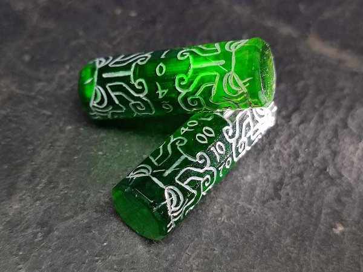
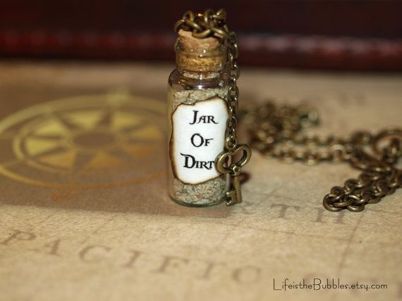

# Plunder: A Pirate's Life – Expansion Rules

> **Status: work in progress.** This is a first draft of the expansion rules — not everything is filled in yet.

## Plundering

Plundering an enemy ship can only be done if:

- Your ship is fully upgraded.
- You must **successfully attack** an enemy ship **without sinking it.**
- After combat, **roll against the defending player** to resolve the Plunder attempt.

The **defending player chooses** one of two roll methods:

- A **1 out of 1 roll-off**, or
- A **2 out of 3 showdown** – best of three rolls wins.

If **you win the roll**, perform one of the following **Plundering actions**:

- **Steal a held item** from the defending ship.
- **Take two random resource cards** from the defending player.

If **you lose the roll**, your attacking ship **loses a life point,** and **no Plundering** takes place.

**Each ship may Plunder only once per turn.** However, you may attempt to **Plunder again** using a **different ship** against a **different enemy vessel.**

## Obtainable Items

### Cthulhu Idol - Relic of the Deep

*(Details on this item are not written yet.)*

### Kraken's Rum & Kraken's Die (D6)

**Setup** - At the start of the game, spin the compasses to determine the location of the **Kraken's Rum.**

**Retrieval** - **Sail over** the space containing the **Kraken's** **Rum.** to **collect it**. If the **Kraken's Rum** is **on land**, your ship must reach an **adjoining ocean space** to claim it – it cannot be collected through **land barriers** or across the **storm's boundary**. Once collected, the **Kraken's Rum** is **bound to the ship** that obtained it. Use a **ship marker** to track ownership, or simply keep the **Kraken's Rum near the claiming ship** during gameplay.

**Losing the Kraken's Rum** - You may **lose** **possession** of the **Kraken's Rum** under one of the following conditions:

- If the **claiming ship** is **lost in battle**, the **Kraken's Rum** is placed at the **location** where the ship **sank**. Any player may **collect it by sailing over that space.**
- If your ship is successfully **Plundered by** **an** **attacker** (see **Plundering** rules), the **Kraken's Rum transfers** to the **attacking ship**.

#### Kraken's Rum Effects

**Passive Effect – The Kraken's Spirits**

- The holder gains **+1 Rum** at the start of each turn.

**Active Effect – Kraken's Draft**

- Before your movement roll, **roll the Kraken's Die** and **resolve its effect.**
- Then, **draw** a number of **Treasure Cards** equal to your roll — **all at once**. Do not resolve any cards until the full set is drawn. If any of the following cards appear — **The Kraken**, **Drink Up**, or **Blackout** — **read them aloud**, but do not trigger their effects immediately.
- If **only one** of the mentioned cards is drawn, **resolve it normally.**
- If **more than one** appears, the **next Pirate in turn** randomly selects **one** for you to resolve. **Ignore** **the others.**
- If the card **Blackout** is selected, the ship carrying the **Kraken's Rum** is the one that is **relocated.**
- After resolving the selected effect, place all drawn Treasure Cards at the bottom of the Treasure Deck.
- **Optional Mechanic –** If the card **The Kraken** is drawn, **move the Kraken** **token** from its current location and **place it in front of your** **nearest ship**. That ship must **bat** **t** **le** **the Kraken** to claim the card's resources.
- **Bonus Effect** – If you **rolled a 6** with the **Kraken's Die**, **gain** **+1** **A** **ttack** during the battle. Attack resets to normal after combat.

#### Kraken's Die Table

| Roll | Effect Name | Outcome |
|---|---|---|
| 1 | Blackout Brew | Lose all **Rum** this turn. Discard 1 additional resource card or skip movement. |
| 2 | Sea Sickness | **-1 Rum**. Nearest opponent gains **+1 rum**. |
| 3 | Scallywag's Swill | **+1 attack** for all owned ships but also **-1 defense** until your next turn. |
| 4 | Fortune's Froth | **+1 Rum** and **+1 Gold**! |
| 5 | Saboteur's Cask | **+1 Rum**. Choose one Pirate to skip their next **Movement Roll**. |
| 6 | Kraken's Favor | **+2 Rum** and immunity from any negative **Rum**-related effects this round. |

#### Card Effects

- **Card Effects**
- **The Kraken** – Description: Ye fashion harpoons ta kill the monster guardin this treasure.
  - **-1 Wood**, **-2 Iron**, **+4 Gold**
- **Drink Up** – Description: Ye find barrels of booze floating adrift. Waste not a drop nor a stave.
  - **+1Wood**, **+1 Rum**
- **Blackout** – Description: This haul be barrels of liquid goodness. Ye celebrate too hard and fall asleep at the helm.
  - **+3 Rum** – Use the compass to relocate your ship. Your turn is now over.

### A Jar of Dirt & Pirate's Coin

> ⚠️ The image above is a placeholder pulled from the source draft — it's another Etsy seller's product photo (watermarked "LifeistheBubbles.etsy.com"), so it can't be used in your own listing. Swap in your own component photo before publishing.

**Setup** - At the start of the game, spin the compasses to determine the location of the **Jar of Dirt.**

**Retrieval** - **Sail over** the space containing the **Jar of Dirt** to **collect it**. If the **Jar of Dirt** is **on land**, your ship must reach an **adjoining ocean space** to claim it – it cannot be collected through **land barriers** or across the **storm's boundary**. Once collected, the **Jar of Dirt** is **bound to the ship** that obtained it. Use a **ship marker** to track ownership, or simply keep the **Jar of Dirt** **near the claiming ship** during gameplay.

**Losing the** **Jar of Dirt** **-** You may **lose possession** of the **Jar of Dirt** under one of the following conditions:

- If the **claiming ship** is **lost in battle**, the **Jar of Dirt** is placed at the **location** where the ship **sank**. Any player may **collect it by sailing over that space.**
- If your ship is successfully **Plundered by an attacker** (see **Plundering** rules), the **Jar of Dirt** **transfers** to the **attacking ship**.

#### Jar of Dirt's Effects

**Passive Effects:**

- **Earthen Fortune** – At the start of your turn, flip the **Pirate's Coin.**
  - Heads: Gain **+1 Iron.**
  - Tails: Gain **+1 Wood.**

**Active Effects:**

- **Land Crossing** – To move across land spaces, flip the **Pirate's Coin** once per **land grid** **tile.** Your ship must end its movement on an **ocean tile** within your **movement roll allowance.**
  - **Heads**: You may cross.
  - **Tails**: Movement fails and may not cross land. Your ship may continue to move on other ocean tiles if there are movements left in your turn.
- **Dirt Defense** – When attacked, flip the **Pirate's Coin** three times.
  - If **two out of three** flips land on **Heads**, your ship is defended from the attack.
  - If **two out of three flips** land on **Tails**, the attack on your ship **is successful.**
